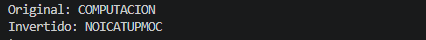
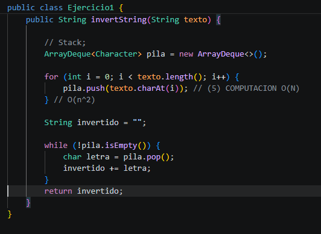
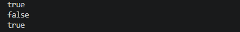
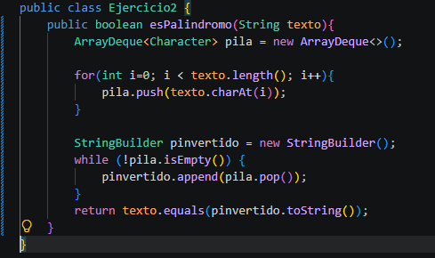

# Práctica: Estructuras Dinámicas Lineales

## Datos del Estudiante
- **Nombre:** [Nataly Jiménez Salazar]
- **Curso:** [Grupo - 3 - Computación]
- **Fecha:** [2026-06-09]

---

## 1. Implementación de estructuras dinámicas lineales

**Fecha:** [2026-06-08]

**Descripción:** 
Se realizó la implementación del invertString que voltea o invierte el orden de los caracteres de una cadena de texto, toma un String y devuelve otro string con los caracteres invertidos.

### Captura de salida en consola



### Captura del código de implementación del ejercicio 1



o bloque de código .


## 2. Ejercicio Palíndromo

**Fecha:** [2026-06-09]

**Descripción:** 
Es este método esPalindromo se verifica si una cadena de texto es un palíndromo, una palabra se lee igual de izquierda a derecha y derecha a izquierda, devolviendo un boleando, true o false.

### Captura de salida en consola



### Método implementado


````java
public boolean esPalindromo(String texto) {
    // Implementación del método
